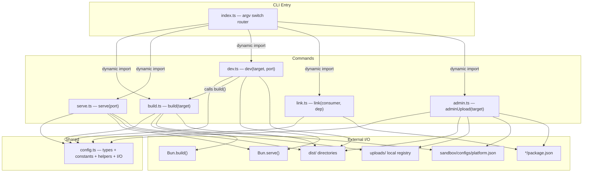

# CLI Architecture — Pre-Plugin Refactor (ARCHIVED)

> **Status:** ARCHIVED — this describes the flat command structure that existed before the plugin refactor.
> See `cli-architecture-proposed.md` for the current architecture.

## Observations

- `index.ts` is a flat switch-case with dynamic imports (proto-plugin shape)
- `config.ts` is a mixed bag: types, path constants, platform.json I/O, and pure helpers
- `build.ts` hard-codes `Bun.build()`; `admin.ts` hard-codes local filesystem copy + platform.json writes
- `dev.ts` depends directly on `build.ts` (calls `build(target)`)
- No extension points exist; every behavior is inline
