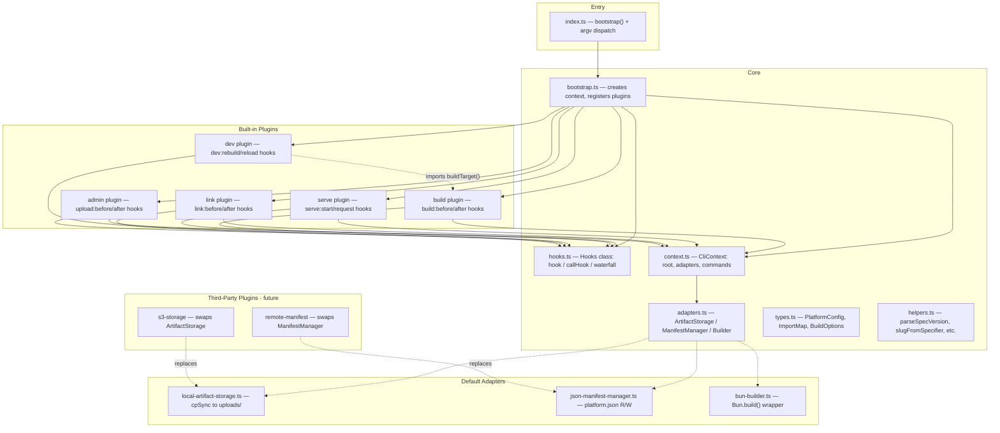

# CLI Plugin Architecture



## Key Design Decisions

### Hook System
Custom minimal (~60 LOC), zero dependencies, typed via declaration merging on `HookMap`. Supports `callHook` (async series) and `waterfall` (value-transforming) patterns. Priority ordering for handler execution.

### Adapter Pattern
Three interfaces isolate swappable backends:
- **ArtifactStorage**: `upload(slug, version, distDir) -> url` — local filesystem by default, swappable to S3/CDN
- **ManifestManager**: `read() / write() / registerPackage()` — JSON file by default, swappable to API/DB
- **Builder**: `build(options) -> result` — Bun.build by default, swappable to other bundlers

### Plugin Interface
```typescript
interface Plugin {
  name: string;
  setup(ctx: CliContext, hooks: Hooks): void | Promise<void>;
}
```

Each plugin registers commands via `ctx.commands.set()` and hooks via `hooks.hook()` during `setup()`.

## Hook Catalog

| Hook | Plugin | Arguments | Purpose |
|------|--------|-----------|---------|
| `build:before` | build | `(target, options)` | Observe/log before build |
| `build:after` | build | `(target, result)` | Post-build actions |
| `build:shell:before` | build | `(config)` | Modify config before shell injection |
| `build:shell:after` | build | `()` | Post-shell-build |
| `serve:start` | serve | `(port)` | Server startup |
| `serve:request` | serve | `(req)` | Request middleware |
| `dev:start` | dev | `(target, port)` | Dev server started |
| `dev:rebuild` | dev | `(target)` | Rebuild triggered |
| `dev:reload` | dev | `()` | SSE reload sent |
| `link:before` | link | `(consumer, dep)` | Pre-link |
| `link:after` | link | `(consumer, depName)` | Post-link |
| `admin:upload:before` | admin | `(target, meta)` | Pre-upload validation |
| `admin:upload:after` | admin | `(target, url, deps)` | Post-upload |
| `admin:register:before` | admin | `(specifier, version, entry)` | Pre-manifest write |
| `admin:register:after` | admin | `()` | Post-manifest write |

Waterfall: `build:options` — lets plugins modify `BuildOptions` before bundling.

## File Structure

```
cli/src/
  index.ts                          bootstrap() + dispatch
  core/
    hooks.ts                        Hooks class + HookMap interface
    plugin.ts                       Plugin interface
    context.ts                      CliContext + CommandDef types
    adapters.ts                     adapter interfaces
    bootstrap.ts                    wire adapters + register plugins
    types.ts                        PlatformConfig, ImportMap, etc.
    helpers.ts                      pure utility functions
  adapters/
    local-artifact-storage.ts       local filesystem uploads
    json-manifest-manager.ts        platform.json read/write
    bun-builder.ts                  Bun.build wrapper
  plugins/
    build.ts                        build command plugin
    serve.ts                        serve command plugin
    dev.ts                          dev server plugin
    link.ts                         dependency linking plugin
    admin.ts                        admin upload plugin
```
