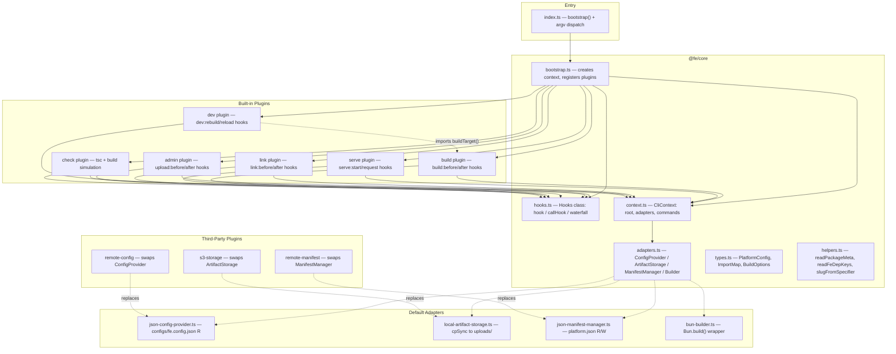

# CLI Plugin Architecture (CURRENT)

> **Status:** IMPLEMENTED — this is the current architecture.
> See `cli-architecture-current.md` for the pre-refactor flat structure (archived).




## Key Design Decisions

### Hook System
Custom minimal (~60 LOC), zero dependencies, typed via declaration merging on `HookMap`. Supports `callHook` (async series) and `waterfall` (value-transforming) patterns.

### Adapter Pattern
Four interfaces isolate swappable backends:
- **ConfigProvider**: `get() -> Required<FeConfig>` — reads `configs/fe.config.json` by default; swappable to env vars, remote config, etc. Stored at `ctx.adapters.config`. All plugins call `.get()` to read CLI config.
- **ArtifactStorage**: `upload(slug, version, distDir) -> url` — local filesystem by default, swappable to S3/CDN
- **ManifestManager**: `read() / write() / registerPackage()` — JSON file by default, swappable to API/DB
- **Builder**: `build(options) -> result` — Bun.build by default, swappable to other bundlers

### Bootstrap sequence
1. `createJsonConfigProvider(root)` — instantiate config adapter
2. `configProvider.get()` — read `plugins`, `manifestPath`, `uploadsDir`, `shellDir`
3. Wire remaining adapters using config values
4. Store `configProvider` in `ctx.adapters.config`
5. Load external plugins; run all plugin `setup()` (builtins first)

### Plugin Interface
```typescript
interface Plugin {
  name: string;
  setup(ctx: CliContext, hooks: Hooks): void | Promise<void>;
}
```

Each plugin registers commands via `ctx.commands.set()` and hooks via `hooks.hook()` during `setup()`. Plugins read CLI config via `ctx.adapters.config.get()`.

## Hook Catalog

| Hook | Plugin | Arguments | Purpose |
|------|--------|-----------|---------|
| `build:before` | build | `(target, options)` | Observe/log before build |
| `build:after` | build | `(target, result)` | Post-build actions |
| `build:shell:before` | build | `()` | Pre-shell-build |
| `build:shell:after` | build | `()` | Post-shell-build |
| `serve:start` | serve | `(port)` | Server startup |
| `serve:request` | serve | `(req)` | Request middleware |
| `dev:start` | dev | `(target, port)` | Dev server started |
| `dev:rebuild` | dev | `(target)` | Rebuild triggered |
| `dev:reload` | dev | `()` | SSE reload sent |
| `link:before` | link | `(consumer, dep)` | Pre-link |
| `link:after` | link | `(consumer, depName)` | Post-link |
| `admin:upload:before` | admin | `(target, meta)` | Pre-upload validation |
| `admin:upload:after` | admin | `(target, url, deps)` | Post-upload |
| `admin:register:before` | admin | `(specifier, version, entry)` | Pre-manifest write |
| `admin:register:after` | admin | `()` | Post-manifest write |

Waterfall: `build:options` — lets plugins modify `BuildOptions` before bundling.

## File Structure

```
packages/core/src/               @fe/core — shared types (published)
  fe-config.ts                   FeConfig interface
  adapters.ts                    ConfigProvider / ArtifactStorage / ManifestManager / Builder interfaces
  context.ts                     CliContext + CommandDef
  plugin.ts                      Plugin interface
  hooks.ts                       Hooks class + HookMap
  types.ts                       PlatformConfig, ImportMap, BuildOptions, BuildResult
  index.ts                       re-exports

packages/cli/src/                @fe/cli — the fe binary (published)
  index.ts                       bootstrap() + dispatch
  bootstrap.ts                   wire adapters + register plugins
  plugin-loader.ts               dynamic import() of external plugins
  helpers.ts                     readPackageMeta, readFeDepKeys, readFeDeps, slugFromSpecifier
  adapters/
    json-config-provider.ts      ConfigProvider: configs/fe.config.json
    local-artifact-storage.ts    ArtifactStorage: local filesystem uploads
    json-manifest-manager.ts     ManifestManager: platform.json read/write
    bun-builder.ts               Builder: Bun.build() wrapper
  plugins/
    build.ts                     build command + exports buildTarget()
    serve.ts                     serve command
    dev.ts                       dev server (HMR via SSE)
    link.ts                      dependency linking
    admin.ts                     admin upload
    check.ts                     typecheck + build simulation

sandbox/configs/                 workspace config (not published)
  fe.config.json                 CLI config (plugins, manifestPath, uploadsDir, shellDir)
  platform.json                  MFE routes + packages registry
```
