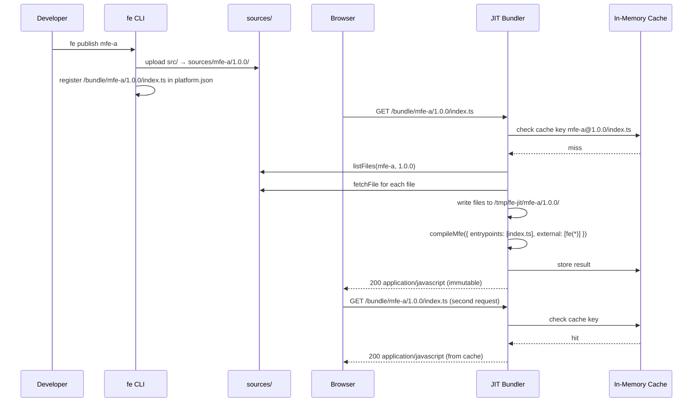

# JIT Compilation

How the Just-In-Time bundler compiles MFE source code on-the-fly when the browser first requests it, caching the result for subsequent requests.

## Motivation

Traditional microfrontend setups require a build step before deployment. An MFE must be compiled, the artifact uploaded to a storage bucket or Source Storage, and the platform configuration updated with the artifact's URL. The JIT approach inverts this: publish the raw TypeScript source, and let the JIT server compile it on first request. Deployment is faster and the Platform Configuration URL is stable across source changes.

## The Flow



## `fe publish` — Source Upload

`fe publish` does not produce a pre-built artifact. It copies the entire `src/` directory to `SourceStorage` and registers a URL of the form `/bundle/<slug>/<version>/index.ts` in `platform.json`:

```json
{
  "packages": {
    "fe(@acme/mfe-a)": {
      "versions": {
        "1.0.0": {
          "url": "/bundle/mfe-a/1.0.0/index.ts",
          "deps": {}
        }
      }
    }
  }
}
```

The default `SourceStorage` implementation (`createLocalSourceStorage`) writes to `sources/<slug>/<version>/` on the local filesystem.

## The JIT Bundler

`createJITBundler` from `@fe/compiler` handles requests matching `/bundle/<slug>/<version>/<path>`:

```ts
const match = url.pathname.match(/^\/bundle\/([^/]+)\/([^/]+)\/(.+)$/);
const [, slug, version, filePath] = match;
```

On a cache miss, it:

1. Calls `storage.listFiles(slug, version)` to enumerate all uploaded source files.
2. Calls `storage.fetchFile` for each file and writes them to a temp directory at `/tmp/fe-jit/<slug>/<version>/`.
3. Calls `compileMfe` with the requested file as the entry point.
4. Stores the compiled JavaScript in memory under the key `slug@version/filePath`.
5. Returns the response with `Cache-Control: public, max-age=31536000, immutable`.

## Framework Detection

`compileMfe` detects framework requirements by inspecting the `package.json` in the source directory:

```ts
if (pkg.dependencies?.["solid-js"] || pkg.devDependencies?.["solid-js"]) {
  hasSolid = true;
}
const plugins = hasSolid ? [SolidPlugin()] : [];
```

A SolidJS MFE automatically gets the Babel-based JSX transform. React MFEs require no special plugin because Bun's native JSX handling covers `react-jsx`. Framework detection is automatic and requires no configuration from the MFE author.

## Caching Strategy

The in-memory cache uses `slug@version/filePath` as the key. Since a published version is immutable (`fe publish` does not overwrite an existing version), the cache does not need invalidation. The browser response includes `immutable` in `Cache-Control`, so both the server and the browser cache are effectively permanent for a given version.

To deploy a new version of an MFE, publish a new version number. The old version remains cached and available. Routes are updated separately from publishing, so old and new versions can coexist in the platform configuration simultaneously.
