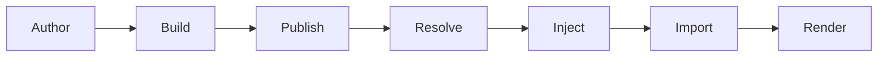

# Architecture Overview

The fe platform exists to answer one question: how do you compose independent frontend applications in a browser without coupling their build tools, frameworks, or deployment schedules? The answer turns out to hinge on something browser engineers already provide for free — native ES module imports and import maps already do most of what a microfrontend platform needs.

## The Full Lifecycle

Every MFE travels through seven stages from authorship to browser rendering.

**Author.** A developer creates a TypeScript package whose `package.json` name follows the `fe(@scope/name)` convention. They export one function, `render`, and develop it in complete isolation from every other team.

**Build.** `fe build` (via `@fe/compiler`) is a verification step. It simulates a bundle of the MFE's source to ensure dependencies are resolvable and the code is valid. These artifacts are useful for local testing but are never published; the platform relies entirely on JIT compilation of the raw source.

**Publish.** `fe publish` runs a pre-flight type check, copies the source tree to `sources/<slug>/<version>/`, and writes a package entry to `platform.json`. The registered URL points to the JIT bundler endpoint (`/bundle/slug/version/index.ts`). Compilation happens on first browser request, not at publish time.

**Resolve.** When the browser loads a page, `@fe/runtime` reads the embedded `platform.json`, looks up the current route's specifier and version, and walks the transitive dependency graph using semver matching against the versions in the platform configuration.

**Inject.** The resolved specifier-to-URL mapping is injected as a `<script type="importmap">` into the document head. The runtime tracks what has already been injected and adds only new entries, so multiple navigations accumulate maps without duplication.

**Import.** `import(specifier)` fires. The browser consults the injected import map, resolves the bare specifier to a URL, and fetches the module. The JIT bundler compiles on demand if the bundle does not yet exist, then caches the result indefinitely.

**Render.** The imported module exports `render`. The shell calls it with a container element and a props object. The MFE owns its slice of the DOM from this point forward.

## How the Packages Fit In

| Package | Role in the lifecycle |
|---------|----------------------|
| `@fe/core` | Shared TypeScript types and interfaces: the contract between all other packages |
| `@fe/cli` | Author → Build → Publish: the `fe` command orchestrates all pre-browser steps |
| `@fe/compiler` | Build and JIT compilation: framework-aware Bun bundler used by both `fe build` and `fe serve` |
| `@fe/runtime` | Resolve → Inject → Import → Render: the browser-side orchestrator shipped inside the shell |

The packages are peers, not a hierarchy. `@fe/core` defines interfaces that `@fe/cli` and `@fe/runtime` implement independently. The CLI never ships to the browser. The runtime never reads the filesystem.

## What Makes This Unusual

Most microfrontend frameworks introduce a shared runtime object (an event bus, a global configuration, a framework-specific store) that every MFE must import. This platform introduces none of those. MFEs share a URL convention, a `render` contract, and a configuration file. The browser's import map mechanism handles everything else.

Two MFEs from different teams, built with different frameworks, deployed on different JIT Servers, compose in the same browser tab without ever having seen each other's source code. That is the proposition this architecture is built to keep.
